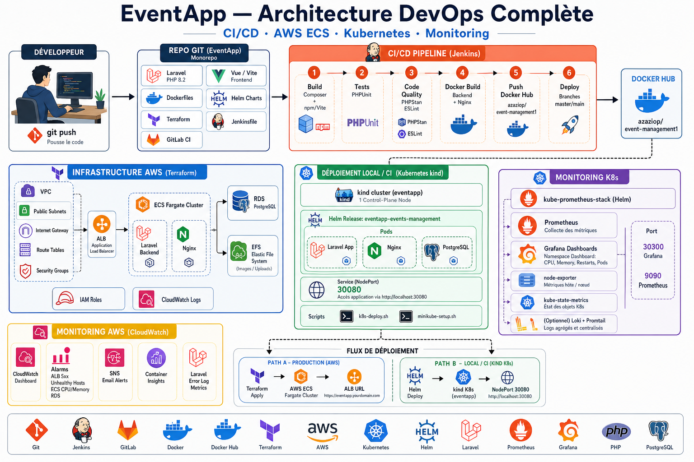
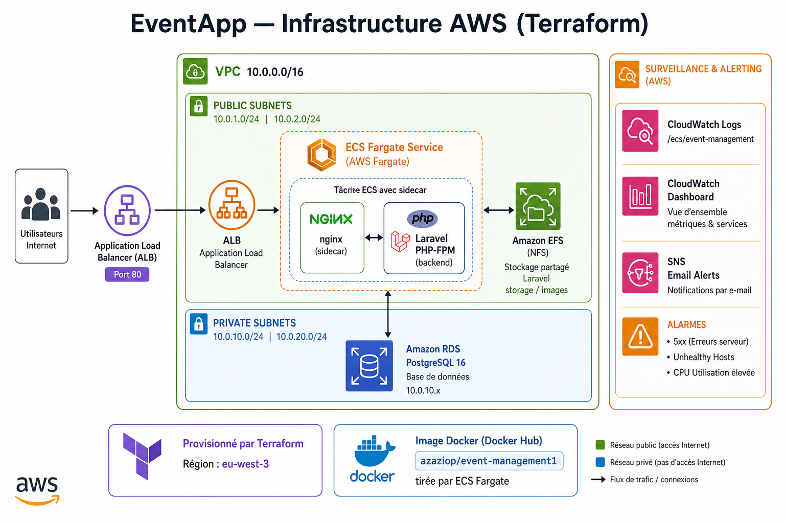

# EventApp — Gestion d'événements

Application web de gestion d'événements construite avec **Laravel 12**, déployée en production sur **AWS ECS Fargate** et orchestrée localement sur **Kubernetes (kind)**. Le projet intègre un pipeline **CI/CD complet** (Jenkins + GitLab CI), une infrastructure **Terraform**, et une stack **observabilité** (Prometheus, Grafana, CloudWatch).

<p align="center">
  
</p>

---

## Sommaire

- [Fonctionnalités](#fonctionnalités)
- [Stack technique](#stack-technique)
- [Architecture](#architecture)
- [Structure du projet](#structure-du-projet)
- [Démarrage rapide (Docker)](#démarrage-rapide-docker)
- [CI/CD](#cicd)
- [Déploiement AWS (Terraform + ECS)](#déploiement-aws-terraform--ecs)
- [Déploiement Kubernetes (Helm + kind)](#déploiement-kubernetes-helm--kind)
- [Monitoring & observabilité](#monitoring--observabilité)
- [Scripts utilitaires](#scripts-utilitaires)
- [Documentation complémentaire](#documentation-complémentaire)

---

## Fonctionnalités

- Création, édition et publication d'événements avec images
- Authentification administrateur (Laravel Breeze + Sanctum)
- Interface moderne **Inertia.js / Vue** avec assets Vite
- Données de démonstration pré-chargées (seeders + photos)
- Déploiement multi-environnement : local, Kubernetes, AWS
- Pipeline CI/CD automatisé : build, tests, qualité, release Docker
- Surveillance applicative et infrastructure (CloudWatch + Prometheus/Grafana)

---

## Stack technique

| Couche | Technologies |
|--------|----------------|
| **Backend** | PHP 8.2, Laravel 12, Inertia.js |
| **Frontend** | Vue 3, Vite, Tailwind CSS |
| **Base de données** | PostgreSQL 16 |
| **Conteneurs** | Docker, nginx + PHP-FPM (sidecar) |
| **CI/CD** | Jenkins, GitLab CI, Docker Hub |
| **IaC** | Terraform (AWS) |
| **Cloud** | ECS Fargate, ALB, RDS, EFS, CloudWatch, SNS |
| **Orchestration** | Kubernetes (kind), Helm 3 |
| **Monitoring** | kube-prometheus-stack, Grafana, Loki (optionnel) |

---

## Architecture

Vue d'ensemble du pipeline DevOps et des environnements de déploiement :

<p align="center">
  
</p>

<p align="center"><em>Architecture globale — CI/CD, Docker, Kubernetes, AWS, Monitoring</em></p>

| Environnement | Accès | Documentation |
|---------------|-------|---------------|
| **Local** | http://localhost:8080 | [Docker Compose](#démarrage-rapide-docker) |
| **Kubernetes** | http://localhost:30080 | [helm/README.md](helm/README.md) |
| **AWS (prod)** | URL ALB (Terraform output) | [terraform/README.md](terraform/README.md) |
| **Grafana** | http://localhost:30300 | [helm/monitoring/README.md](helm/monitoring/README.md) |
| **Prometheus** | http://localhost:9090 | [helm/monitoring/README.md](helm/monitoring/README.md) |

---

## Structure du projet

```
events/
├── app/                    # Code Laravel (controllers, models, …)
├── database/               # Migrations, seeders, assets démo
├── docker/                 # Configurations nginx
├── helm/
│   ├── events-management/  # Chart Helm application
│   └── monitoring/         # Prometheus, Grafana, Loki
├── scripts/                # Déploiement K8s, ECS, monitoring
├── terraform/              # Infrastructure AWS (VPC, ECS, RDS, …)
├── docs/                   # Diagramme d'architecture
├── Jenkinsfile             # Pipeline CI/CD principal
├── .gitlab-ci.yml          # Pipeline GitLab alternatif
├── docker-compose.yml      # Environnement local
└── Dockerfile              # Image backend Laravel
```

---

## Démarrage rapide (Docker)

### Prérequis

- Docker & Docker Compose
- Git

### Installation

```bash
git clone <repo-url> events && cd events

# Lancer l'application
docker compose up -d --build

# Migrations + données de démonstration
docker compose exec backend php artisan migrate --force
docker compose exec backend php artisan db:seed --class=AdminUserSeeder --force
docker compose exec backend php artisan db:seed --class=EventSeeder --force
docker compose exec backend sh -lc 'rm -f public/storage && php artisan storage:link && php artisan optimize:clear'
```

### Accès

| | |
|--|--|
| **Application** | http://localhost:8080 |
| **Admin** | `admin@example.com` / `secret` |

### Commandes utiles

```bash
docker compose logs -f              # Logs en temps réel
docker compose exec backend sh      # Shell dans le conteneur backend
docker compose down                 # Arrêter les services
```

### Image Docker Hub

```bash
docker pull azaziop/event-management1:latest
```

Repository : [azaziop/event-management1](https://hub.docker.com/r/azaziop/event-management1)

---

## CI/CD

### Jenkins (pipeline principal)

Le [Jenkinsfile](Jenkinsfile) exécute automatiquement sur `master` / `main` :

| Stage | Description |
|-------|-------------|
| Build | Composer + npm/Vite, compilation assets |
| Tests | PHPUnit (`php artisan test`) |
| Qualité | Analyse statique du code |
| Docker | Build image backend + nginx |
| Push | Publication sur Docker Hub |
| K8s | Déploiement Helm sur cluster **kind** |
| Monitoring | Stack Prometheus + Grafana |
| ECS | Mise à jour du service AWS Fargate |

**Credentials Jenkins requis :**

- `dockerhub-credentials` — Docker Hub (username + token)
- `aws-credentials` — AWS (`AWS_ACCESS_KEY_ID` / `AWS_SECRET_ACCESS_KEY`)

**Variables d'environnement optionnelles :**

| Variable | Défaut | Description |
|----------|--------|-------------|
| `DEPLOY_MINIKUBE` | `true` | Désactiver le déploiement K8s |
| `K8S_CLUSTER` | auto | `kind` ou `minikube` |
| `ECS_CLUSTER` | `event-management-cluster` | Cluster ECS cible |
| `AWS_REGION` | `eu-west-3` | Région AWS |

### GitLab CI (alternative)

Pipeline défini dans [.gitlab-ci.yml](.gitlab-ci.yml) : build → test → release → deploy Docker Hub.

Variables CI/CD GitLab : `DOCKERHUB_USERNAME`, `DOCKERHUB_TOKEN`, `DOCKERHUB_REPOSITORY`.

---

## Déploiement AWS (Terraform + ECS)

Infrastructure provisionnée dans `terraform/` :

<p align="center">
  
</p>

<p align="center"><em>Production AWS — VPC, ALB, ECS Fargate, RDS, EFS, CloudWatch, SNS</em></p>

```bash
cd terraform
cp terraform.tfvars.example terraform.tfvars   # APP_KEY, db_password, alert_email
terraform init
terraform plan
terraform apply

terraform output application_url
terraform output cloudwatch_dashboard_url
```

Déploiement d'une nouvelle image via Jenkins ou manuellement :

```bash
export IMAGE_TAG=<build-number-commit>
./scripts/ecs-deploy.sh
```

Documentation détaillée : [terraform/README.md](terraform/README.md)

---

## Déploiement Kubernetes (Helm + kind)

### Prérequis

kubectl, Helm 3, Docker (kind installé automatiquement si absent)

### Déploiement

```bash
# 1. Créer le cluster (kind sur Mac/Jenkins, Minikube en local classique)
./scripts/minikube-setup.sh

# 2. Configurer kubectl (si contexte minikube obsolète)
eval "$(./scripts/k8s-env.sh)"

# 3. Déployer l'application
export IMAGE_TAG=<tag-jenkins>    # ex. 32-a1b2c3d
./scripts/k8s-deploy.sh

# 4. Déployer le monitoring
./scripts/k8s-monitoring-deploy.sh
./scripts/k8s-monitoring-start.sh
```

| Service | URL |
|---------|-----|
| Application | http://localhost:30080 |
| Grafana | http://localhost:30300 (`admin` / `admin`) |
| Prometheus | http://localhost:9090 |

Documentation : [helm/README.md](helm/README.md)

---

## Monitoring & observabilité

### Kubernetes — kube-prometheus-stack

| Composant | Rôle |
|-----------|------|
| **Prometheus** | Collecte métriques pods, nodes, K8s |
| **Grafana** | Dashboards (dont « namespace » : CPU, RAM, restarts, pods) |
| **node-exporter** | Métriques CPU/RAM des nœuds |
| **kube-state-metrics** | État des ressources Kubernetes |
| **Loki + Promtail** | Logs centralisés (optionnel sur kind) |

### AWS — CloudWatch

- Dashboard ECS / ALB / RDS
- Alarmes : erreurs 5xx, hosts unhealthy, CPU/mémoire ECS, RDS
- Notifications email via SNS
- Métriques d'erreurs Laravel dans les logs

Documentation : [helm/monitoring/README.md](helm/monitoring/README.md)

---

## Scripts utilitaires

| Script | Description |
|--------|-------------|
| `scripts/minikube-setup.sh` | Crée/démarre le cluster kind ou Minikube |
| `scripts/k8s-env.sh` | Corrige `KUBECONFIG` (`eval "$(./scripts/k8s-env.sh)"`) |
| `scripts/k8s-deploy.sh` | Déploie l'app via Helm |
| `scripts/k8s-monitoring-deploy.sh` | Installe Prometheus + Grafana |
| `scripts/k8s-monitoring-start.sh` | Port-forward Grafana + Prometheus (arrière-plan) |
| `scripts/k8s-monitoring-access.sh` | Port-forward interactif |
| `scripts/ecs-deploy.sh` | Met à jour le service ECS avec une nouvelle image |
| `scripts/ecs-seed-deploy.sh` | Redéploie + seed des événements démo sur ECS |

---

## Documentation complémentaire

| Document | Contenu |
|----------|---------|
| [terraform/README.md](terraform/README.md) | VPC, ECS, RDS, EFS, CloudWatch, troubleshooting |
| [helm/README.md](helm/README.md) | Chart application, déploiement K8s, Jenkins |
| [helm/monitoring/README.md](helm/monitoring/README.md) | Prometheus, Grafana, dashboard exercice |
## Diagrammes d'architecture

| Diagramme | Fichier |
|-----------|---------|
| Architecture DevOps complète | [docs/eventapp-architecture-devops.png](docs/eventapp-architecture-devops.png) |
| Infrastructure AWS (Terraform + ECS) | [docs/aws-ecs-architecture.png](docs/aws-ecs-architecture.png) |

<p align="center">
  
  &nbsp;&nbsp;
  
</p>

---

## Compte administrateur par défaut

| Champ | Valeur |
|-------|--------|
| Email | `admin@example.com` |
| Mot de passe | `secret` |

> Changez ces identifiants en production.

---

## Licence

Projet à usage éducatif / portfolio. Laravel est sous [licence MIT](https://opensource.org/licenses/MIT).
